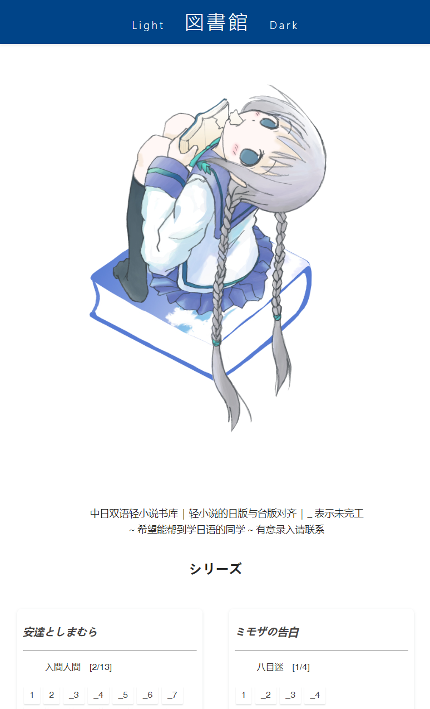
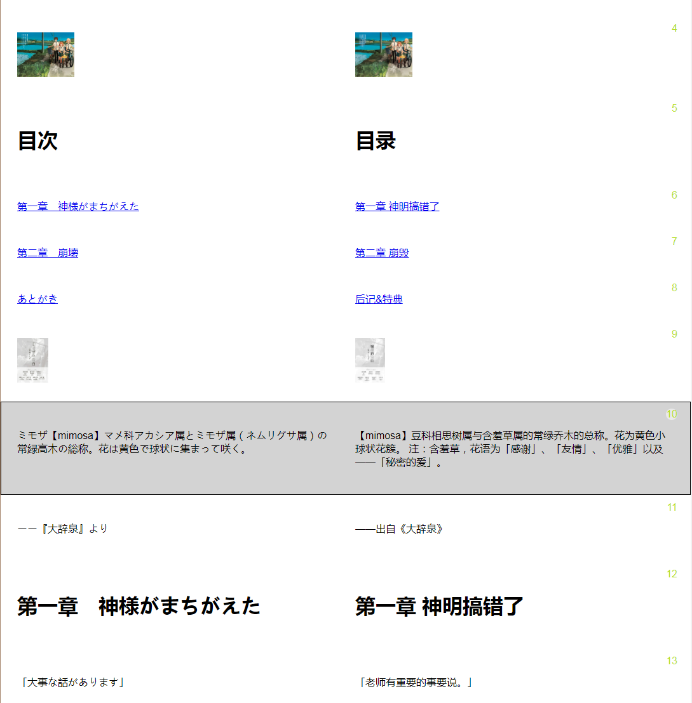

这是一个中日双语轻小说书库，希望能对您的语言学习有帮助

## 使用
1. 默认高亮点选的句子并且复制日文到剪切板，可点击 <kbd>SelectCopy</kbd> 切换成复制选中文本，都是默认去除振假名；
2. 键盘方向键 <kbd>↑</kbd> 上一句 和 <kbd>↓</kbd> 上一句，也会触发复制（受复制开关控制）；
3. 蒙版模式 <kbd>Mark</kbd> 仅显示选中的文本，其余隐藏；

## 预览

